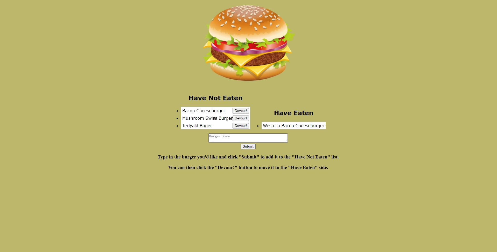

# TG-Burger-Logger

## Overview

This app was designed to utilize various new resources that we've learned over the week including:
* Handlebars
* MySql
* MVC
* Express
* NodeJs

The app's layout is set up as one main page with an input box to input data and then submit it. It will then update the MySql database table with the new information and then display the information on the current page. The viewable information from the table on the page is placed on the page based on the values of some of the data within the table.

## Description

This is the main page with a few of the viewable items from the table displayed under **"Have Not Eaten"** and **"Have Eaten"**. The submit box below is there to enter in a new item and then submit it to be added to the table. The new item will have a hidden value of **Devoured** that is defaulted to false when initially added.

Once the item has been typed into the box and submitted, it is then added to the **Have Not Eaten** side with a hidden **Devoured** value of false. The **Devour!** button is generated with all of the items that have a **Devoured** value of false.

After the **Devour!** button has been pressed on the item of your choosing, it changes the boolean **Devoured** value over to true, which it is then moved to the **Have Eaten** side and the button is removed. There is no delete functionality as the homework readme never requested it.

## Links

The app has been deployed to both Github and Heroku. The Heroku side was a little difficult to set up because I had to enable the MySql functionality.

* [Github](https://github.com/Teknix420/TG-Burger-Logger)
* [Heroku](https://tg-burger-logger.herokuapp.com/)